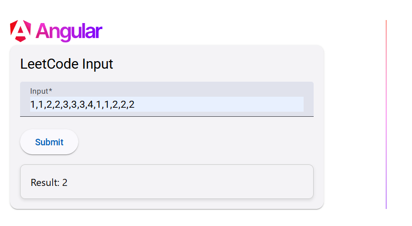

# LeetCode/HackerRank Algorithm Web App

Practice your web dev skills while solving programming algorithm challenges!



## What is it?

This project is an Angular web application for writing LeetCode-style algorithms. It provides a base web application for implementing LeetCode/HackerRank style algorithms, but at the same time, practicing web dev skills. Instead of using a third-party web site to solve programming problems, you can write them into this application framework and improve your skill in Angular, TypeScript, and VSCode in the process!

## Tech Stack

- Angular
- TypeScript
- Material UI
- VSCode

## Development server

This project was generated using [Angular CLI](https://github.com/angular/angular-cli) version 19.1.7.

To start a local development server, run:

```bash
ng serve
```

Once the server is running, open your browser and navigate to `http://localhost:4200/`. The application will automatically reload whenever you modify any of the source files.

## Code scaffolding

Angular CLI includes powerful code scaffolding tools. To generate a new component, run:

```bash
ng generate component component-name
```

For a complete list of available schematics (such as `components`, `directives`, or `pipes`), run:

```bash
ng generate --help
```
